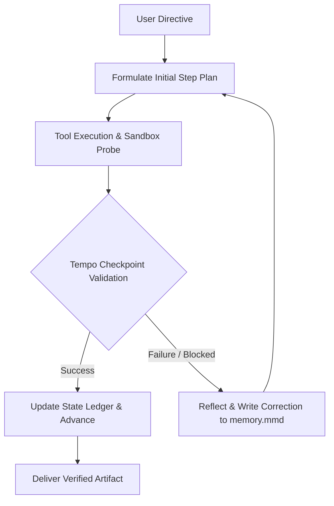

# 🧠 DOT3 Note Model Architecture & Self-Learning State Ledger

## 1. Overview
The DOT3 Note Model Architecture is an autonomous, long-running agent execution standard designed for complex multi-step workflows. Unlike single-turn conversational models, DOT3 operates with persistent self-correcting checkpoints, wide working memory, and dynamic runtime feedback.

---

## 2. The 4 Architectural Pillars

### 1. Tempo Multi-Step Checkpointing ("The Map-Check Method")
- Evaluates task progress every 2–3 actions rather than grading only at the end.
- Verifies tool output, probes sandboxes, and recalibrates the plan to halt trajectory drift before compounding errors emerge.

### 2. Dynamic Self-Correcting State Ledger (`memory.mmd`)
- Maintains an active Mermaid state ledger during runtime.
- When an action or tool fails, the agent pauses, records the root-cause lesson into `memory.mmd`, and carries the correction forward instead of repeating naive loops.

### 3. 512,000-Token Systemic Working Memory
- Holds multi-file codebases, research dossiers, 300+ agent tables, and project constraints in active focus simultaneously.

### 4. Deterministic Exploration & Adaptation
- Probes unfamiliar APIs, handles unexpected environment constraints, and delivers verified working deliverables backed by real execution rather than intent promises.

---

## 3. Implementation Workflow

